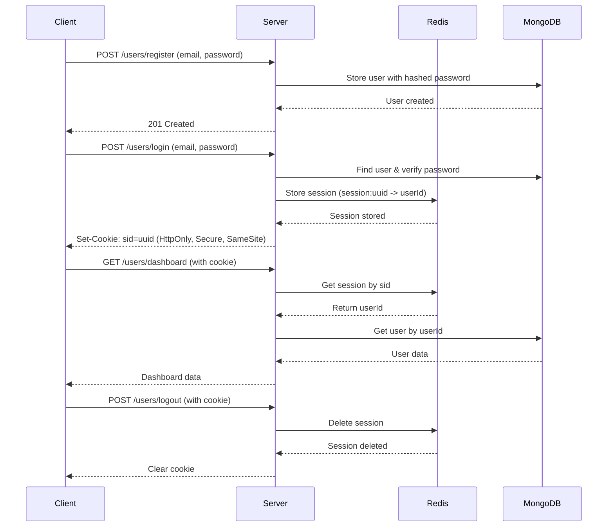

# 🔐 Session-Based Authentication (Auth-v1)

A complete implementation of **Session-Based Authentication** using Node.js, Express, MongoDB, and Redis. This project is part of a series exploring different authentication methods from basic to advanced.

## 📋 Table of Contents

- [Overview](#overview)
- [Features](#features)
- [Tech Stack](#tech-stack)
- [How It Works](#how-it-works)
- [Installation](#installation)
- [API Endpoints](#api-endpoints)
- [Security Features](#security-features)
- [Attack Vectors](#attack-vectors)
- [Pros & Cons](#pros--cons)
- [Testing](#testing)

## 🎯 Overview

Session-Based Authentication is one of the oldest and most traditional authentication methods. When a user logs in, the server creates a session and stores it in a database (Redis in this case). The session ID is sent to the client as a cookie, which is then used to authenticate subsequent requests.

## ✨ Features

- ✅ User registration with password hashing (bcrypt)
- ✅ Login with session creation
- ✅ Session storage in Redis
- ✅ Secure HTTP-only cookies
- ✅ Session expiration (7 days)
- ✅ Protected routes with middleware
- ✅ Logout with session destruction
- ✅ User-specific dashboard

## 🛠 Tech Stack

- **Runtime**: Node.js
- **Framework**: Express.js
- **Database**: MongoDB (user data)
- **Session Store**: Redis (session data)
- **Password Hashing**: bcrypt
- **Cookie Parsing**: cookie-parser

## 🔄 How It Works



## 📦 Installation

### Prerequisites

- Node.js (v18+)
- MongoDB (running locally or cloud)
- Redis (running locally or cloud)

### Steps

1. **Clone the repository**
   ```bash
   git clone <your-repo-url>
   cd Auth-v1
   ```

2. **Install dependencies**
   ```bash
   npm install
   ```

3. **Configure MongoDB**
   - Update `config/db.js` with your MongoDB connection string

4. **Configure Redis**
   - Update `config/redis.js` with your Redis credentials
   ```javascript
   const redisClient = createClient({
     password: "your-redis-password",
   });
   ```

5. **Run the server**
   ```bash
   npm run dev
   ```

   Server will start on `http://localhost:5000`

## 🌐 API Endpoints

### Authentication Routes

| Method | Endpoint | Description | Auth Required |
|--------|----------|-------------|---------------|
| POST | `/users/register` | Register a new user | ❌ |
| POST | `/users/login` | Login and create session | ❌ |
| POST | `/users/logout` | Logout and destroy session | ✅ |
| GET | `/users/dashboard` | Get user dashboard data | ✅ |

### Request/Response Examples

#### Register
```bash
POST /users/register
Content-Type: application/json

{
  "name": "John Doe",
  "email": "john@example.com",
  "password": "password123"
}
```

**Response:**
```json
{
  "message": "User Registered Successfully",
  "details": { ... }
}
```

#### Login
```bash
POST /users/login
Content-Type: application/json

{
  "email": "john@example.com",
  "password": "password123"
}
```

**Response:**
```json
{
  "message": "logged in"
}
```
*Sets cookie: `sid=<session-id>`*

#### Dashboard (Protected)
```bash
GET /users/dashboard
Cookie: sid=<session-id>
```

**Response:**
```json
{
  "message": "dashboard",
  "details": {
    "_id": "...",
    "name": "John Doe",
    "email": "john@example.com"
  }
}
```

#### Logout
```bash
POST /users/logout
Cookie: sid=<session-id>
```

**Response:**
```json
{
  "message": "logged out"
}
```

## 🔒 Security Features

### Implemented

| Feature | Description | Protection Against |
|---------|-------------|-------------------|
| **HttpOnly Cookies** | Cookie not accessible via JavaScript | XSS attacks |
| **Secure Flag** | Cookie only sent over HTTPS | Man-in-the-middle |
| **SameSite=Lax** | Cookie not sent on cross-site requests | CSRF attacks |
| **Signed Cookies** | Cookie integrity verification | Cookie tampering |
| **Password Hashing** | bcrypt with salt rounds | Password leaks |
| **Session Expiration** | 7-day TTL in Redis | Indefinite sessions |
| **Session Namespacing** | `session:uuid` keys in Redis | Key collisions |

### Cookie Configuration
```javascript
res.cookie("sid", sessionId, {
  httpOnly: true,    // Prevents XSS
  sameSite: "lax",   // Prevents CSRF
  secure: true,      // HTTPS only
  maxAge: 604800000  // 7 days
});
```

## ⚠️ Attack Vectors

### How Attackers Could Exploit This System

| Attack Type | How It Works | Mitigation |
|-------------|--------------|------------|
| **Session Hijacking** | Attacker steals cookie via XSS | ✅ HttpOnly flag prevents JS access |
| **Session Fixation** | Attacker sets session ID before login | ⚠️ Not implemented (should regenerate session on login) |
| **CSRF** | Attacker tricks user into making requests | ✅ SameSite=Lax provides basic protection |
| **Brute Force** | Attacker tries multiple passwords | ⚠️ No rate limiting implemented |
| **Cookie Tampering** | Attacker modifies cookie value | ✅ Signed cookies detect tampering |
| **Redis Compromise** | Attacker gains access to Redis | ⚠️ All sessions compromised |

### Security Rating: **6.5/10** (Good for learning, needs hardening for production)

## ✅ Pros & Cons

### Pros
- ✅ Simple to understand and implement
- ✅ Server has full control over sessions
- ✅ Easy to invalidate sessions (logout, ban user)
- ✅ Can store complex session data
- ✅ Works well for traditional web apps

### Cons
- ❌ Requires server-side storage (Redis/DB)
- ❌ Difficult to scale horizontally (session sharing)
- ❌ Not ideal for mobile apps
- ❌ CORS complications for SPAs
- ❌ Server must query session store on every request
- ❌ Stateful (server must remember sessions)

## 🧪 Testing

### Using cURL

**Register:**
```bash
curl -X POST http://localhost:5000/users/register \
  -H "Content-Type: application/json" \
  -d '{"name":"Test User","email":"test@example.com","password":"test123"}'
```

**Login:**
```bash
curl -X POST http://localhost:5000/users/login \
  -H "Content-Type: application/json" \
  -d '{"email":"test@example.com","password":"test123"}' \
  -c cookies.txt
```

**Dashboard:**
```bash
curl -X GET http://localhost:5000/users/dashboard \
  -b cookies.txt
```

**Logout:**
```bash
curl -X POST http://localhost:5000/users/logout \
  -b cookies.txt
```

### Using Postman

1. Create a new request collection
2. For login, go to **Tests** tab and add:
   ```javascript
   pm.cookies.jar();
   ```
3. Cookies will be automatically managed across requests

## 📚 Learning Objectives

This project demonstrates:
- How traditional session-based authentication works
- Server-side session management with Redis
- Secure cookie handling
- Password hashing best practices
- Protected route middleware
- Session lifecycle (create, validate, destroy)

## 🚀 Next Steps

This is **Part 1** of the Authentication Series. Next implementations:
- **Auth-v2**: JWT Token Authentication
- **Auth-v3**: JWT Access + Refresh Tokens
- **Auth-v4**: OAuth 2.0 (Google, GitHub)
- **Auth-v5**: Passwordless (Magic Links)

## 📝 Notes

- This implementation is for **learning purposes**
- For production, add: rate limiting, CSRF tokens, session regeneration, IP validation
- The `secure: true` flag requires HTTPS (disable for local development)
- Redis password should be in environment variables, not hardcoded

## 📄 License

MIT

---

**Built with ❤️ for learning authentication patterns**
