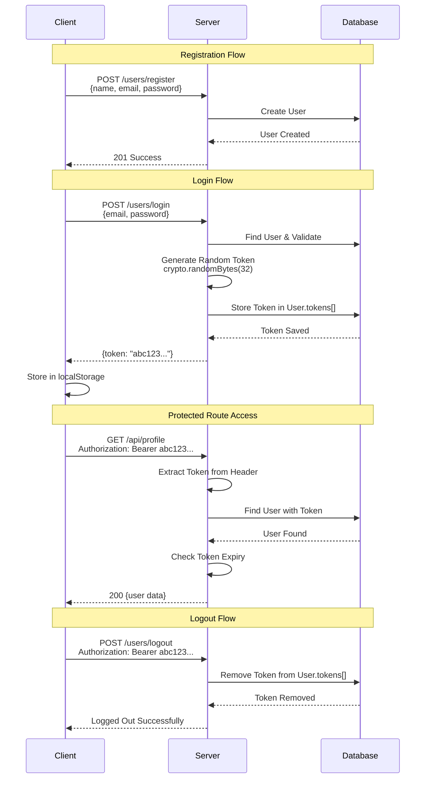

# 🔐 Authentication Types - Learning Project

A comprehensive learning project exploring different authentication methods in Node.js, from basic to advanced security implementations.

## 📚 Project Overview

This repository contains mini-projects demonstrating various authentication mechanisms, their security implications, attack vectors, and best practices. Each implementation is designed to help understand **why** certain methods are used and **when** to avoid them.

---

## 🎯 Current Implementation: Bearer Token Authentication

### What is Bearer Token?
A **static token-based authentication** where the server generates a random token and stores it in the database. The client sends this token with each request in the `Authorization` header.

### Architecture Diagram



---

## 🏗️ Project Structure

```
Auth-v2/
├── models/
│   └── usersModel.js          # User schema with tokens array
├── controllers/
│   ├── authController.js      # Register, Login, Logout
│   └── protectedController.js # Protected route handlers
├── middleware/
│   └── authMiddleware.js      # Bearer token validation
├── routes/
│   ├── authRoutes.js          # Auth endpoints
│   └── protectedRoutes.js     # Protected endpoints
├── config/
│   ├── db.js                  # MongoDB connection
│   └── redis.js               # Redis client (future use)
└── app.js                     # Express app setup
```

---

## 🔌 API Endpoints

### Authentication Routes (`/users`)

| Method | Endpoint | Description | Auth Required |
|--------|----------|-------------|---------------|
| POST | `/users/register` | Create new user | ❌ |
| POST | `/users/login` | Login & get bearer token | ❌ |
| POST | `/users/logout` | Invalidate current token | ✅ |

### Protected Routes (`/api`)

| Method | Endpoint | Description | Auth Required |
|--------|----------|-------------|---------------|
| GET | `/api/profile` | Get user profile | ✅ |
| GET | `/api/dashboard` | Access dashboard | ✅ |

---

## 🧪 Testing the Implementation

### 1. Register a User
```bash
POST http://localhost:5000/users/register
Content-Type: application/json

{
  "name": "John Doe",
  "email": "john@example.com",
  "password": "1234"
}
```

### 2. Login
```bash
POST http://localhost:5000/users/login
Content-Type: application/json

{
  "email": "john@example.com",
  "password": "1234"
}

# Response: { "message": "logged in", "token": "a1b2c3..." }
```

### 3. Access Protected Route
```bash
GET http://localhost:5000/api/profile
Authorization: Bearer <your-token-here>
```

### 4. Logout
```bash
POST http://localhost:5000/users/logout
Authorization: Bearer <your-token-here>
```

---

## 🔐 Security Analysis

### ✅ What Bearer Token Does Well
- Simple to implement
- Easy to understand
- Supports multi-device login (multiple tokens per user)
- Server-side token revocation (logout works)

### ⚠️ Security Vulnerabilities

| Attack Vector | How It Works | Severity |
|---------------|--------------|----------|
| **XSS (Cross-Site Scripting)** | If token stored in `localStorage`, malicious scripts can steal it | 🔴 High |
| **Token Replay** | Stolen tokens can be reused until expiry | 🟡 Medium |
| **No Signature** | Token is just a random string, no integrity verification | 🟡 Medium |
| **Database Lookup** | Every request requires DB query (performance issue) | 🟠 Low |

### 🛡️ Security Rating: **Low** (2/10)

**Why rarely used in production:**
- ❌ No built-in expiration mechanism (requires manual implementation)
- ❌ Vulnerable to XSS attacks when stored in localStorage
- ❌ No payload/claims (can't embed user info)
- ❌ Requires database lookup on every request
- ❌ No cryptographic signature for integrity

---

## 🎓 Key Learnings

### Token Storage in User Model
```javascript
tokens: [{
  token: String,              // Random hex string
  createdAt: Date,            // Timestamp
  expiresAt: Date             // 24 hours from creation
}]
```

### Middleware Flow
1. Extract `Authorization` header
2. Verify it starts with `Bearer `
3. Extract token from header
4. Query database for user with this token
5. Check if token expired
6. Attach user to `req.user` and continue

### Attack Demonstrations
- **XSS Demo**: Malicious script accessing `localStorage.getItem('token')`
- **Replay Attack**: Using same token after logout (fails ✅)
- **Expiration**: Token becomes invalid after 24 hours

---

## 🚀 Running the Project

### Prerequisites
- Node.js (v14+)
- MongoDB
- Redis (optional)

### Installation
```bash
npm install
```

### Environment Variables
Create a `.env` file:
```env
MONGO_URI=mongodb://localhost:27017/auth-types
PORT=5000
```

### Start Server
```bash
npm run dev
```

---

## 📋 Upcoming Authentication Methods

- [ ] **JWT Token** (Stateless authentication)
- [ ] **JWT Access Token** (Short-lived tokens)
- [ ] **Access + Refresh Token** (Token rotation)
- [ ] **OAuth 2.0** (Third-party authentication)

---

## 🤝 Contributing

This is a learning project. Feel free to:
- Suggest improvements
- Report security issues
- Add new authentication methods
- Improve documentation

---

## 📄 License

MIT License - Feel free to use for learning purposes

---

## 🔗 Resources

- [OWASP Authentication Cheat Sheet](https://cheatsheetseries.owasp.org/cheatsheets/Authentication_Cheat_Sheet.html)
- [JWT.io](https://jwt.io/)
- [OAuth 2.0 RFC](https://oauth.net/2/)

---

**⚠️ Disclaimer**: This project is for educational purposes only. Do not use Bearer Token authentication in production applications without additional security measures.
