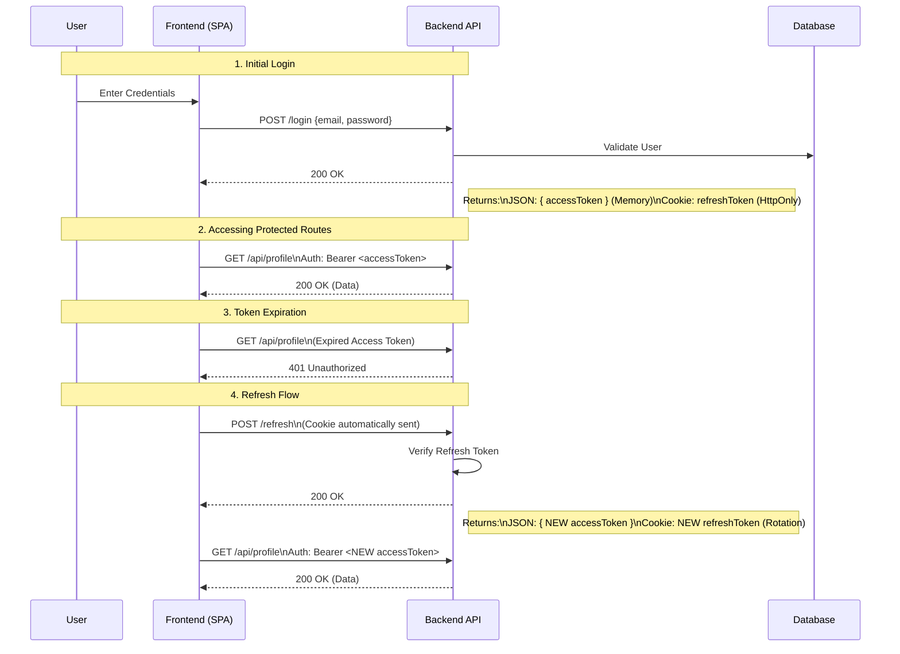

# Access + Refresh Token Authentication System

A secure, production-ready authentication implementation using **Node.js**, **Express**, and **JWT**.  
This project demonstrates the "Best Practice" strategy for Single Page Applications (SPAs) and Mobile Apps: **Short-lived Access Tokens** combined with **Long-lived, HttpOnly Refresh Tokens**.

---

## 🚀 Key Features

*   **Access Token**: Short-lived (15 mins), stored in client memory (JSON). Used for API access.
*   **Refresh Token**: Long-lived (7 days), stored in **HttpOnly, Secure Cookie**. Used only to get new Access Tokens.
*   **Token Rotation**: Every time a Refresh Token is used, a *new* Refresh Token is issued, preventing replay attacks.
*   **Security**:
    *   **XSS Protection**: Refresh token cannot be read by JavaScript (HttpOnly).
    *   **CSRF Protection**: Cookies use `SameSite=Strict`.
    *   **No LocalStorage**: Sensitive long-term tokens are never stored in LocalStorage.

---

## 🛠️ Architecture & Workflow

### How it Works (The Concept)
1.  **Login**: User logs in. Server sends `accessToken` (data) and `refreshToken` (cookie).
2.  **Access Data**: Client sends `accessToken` in `Authorization` header.
3.  **Expiration**: When `accessToken` expires, API returns `401 Unauthorized`.
4.  **Silent Refresh**: Client hits `/refresh` endpoint. Browser automatically sends the `refreshToken` cookie.
5.  **Rotation**: Server verifies cookie, issues **NEW** `accessToken` and **NEW** `refreshToken` (rotation).

### Sequence Diagram


---

## 🔌 API Endpoints

| Method | Endpoint | Description | Auth Required |
| :--- | :--- | :--- | :--- |
| **POST** | `/users/register` | Register a new user | ❌ |
| **POST** | `/users/login` | Login and receive Tokens | ❌ |
| **POST** | `/users/refresh` | Exchange cookie for new Access Token | ❌ (Cookie) |
| **POST** | `/users/logout` | Clear refresh token cookie | ✅ |
| **GET** | `/api/profile` | Protected User Profile route | ✅ (Bearer) |

---

## 💻 Tech Stack
*   **Node.js & Express**: Backend Framework.
*   **JWT (jsonwebtoken)**: Token signing and verification.
*   **Cookie-Parser**: Reading HttpOnly cookies.
*   **Mongoose**: MongoDB database modeling.

---

## ⚙️ Setup & Installation

1.  **Clone the Repository**
    ```bash
    git clone <your-repo-url>
    cd Auth-v5
    ```

2.  **Install Dependencies**
    ```bash
    npm install
    ```

3.  **Environment Variables**
    Create a `.env` file in the root directory:
    ```env
    PORT=5000
    MONGO_URI=your_mongodb_connection_string
    # Secrets (Make these complex!)
    ACCESS_TOKEN_SECRET=super_secret_access_key_123
    REFRESH_TOKEN_SECRET=super_secret_refresh_key_456
    NODE_ENV=development
    ```

4.  **Run the Server**
    ```bash
    npm run dev
    ```

---

## 🛡️ Security Decisions Explained

### Why not LocalStorage?
Storing tokens in `localStorage` makes them accessible to any JavaScript running on your page. If your site has an **XSS vulnerability** (e.g., from a compromised 3rd party script), attacker can read `localStorage` and steal your token.

### Why HttpOnly Cookie?
`HttpOnly` cookies **cannot be accessed by JavaScript**. Even if an attacker executes XSS on your site, they cannot read the Refresh Token. This prevents them from stealing your long-term session.

### Why Access Token in Memory?
Since the Refresh Token is safe in the cookie, we put the Access Token in memory.
*   **Pros**: Immune to CSRF (since it's not a cookie automatically sent).
*   **Cons**: Vanishes on page reload.
*   **Solution**: On app load, the frontend silently calls `/refresh` to get a fresh Access Token immediately.
